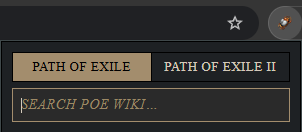
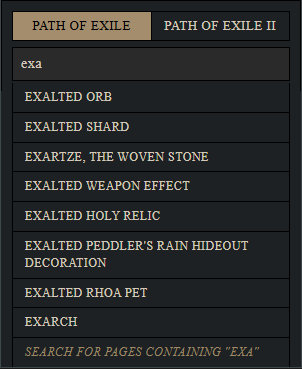

# PoE Wiki Quick Search

PoE Wiki Quick Search is a Chrome extension that lets you quickly search the Path of Exile wikis (PoE1 and PoE2) from a popup with autocomplete, styled after the official PoE Trade UI.

## ✨ Features

- Toggle between PoE1 (`poewiki.net`) and PoE2 (`poe2wiki.net`) with one click
- Autocomplete dropdown with clickable, middle-clickable, and Ctrl+Click links
- Exact page open when pressed Enter; fallback to wiki search if no exact match
- Authentic PoE Trade-themed UI and keyboard navigation

## 📸 Screenshots

**Extension popup — waiting for input**

**Dropdown with live wiki suggestions**

  

_UI styled after the official Path of Exile Trade aesthetic for visual consistency._

## ⚙️ Installation

1. Clone this repository
2. Open `chrome://extensions/`
3. Enable Developer Mode
4. Click "Load unpacked" and select this folder

## 🧭 Planned Features

- Options page (defaults, open behavior)
- Alternative data sources (e.g., PoEDB)
- Additional keyboard shortcuts and accessibility improvements

## 🙌 Credits

- Fonts: Fontin by Exljbris Font Foundry (free use)
- Content: `poewiki.net` and `poe2wiki.net`

## 📜 License

MIT

